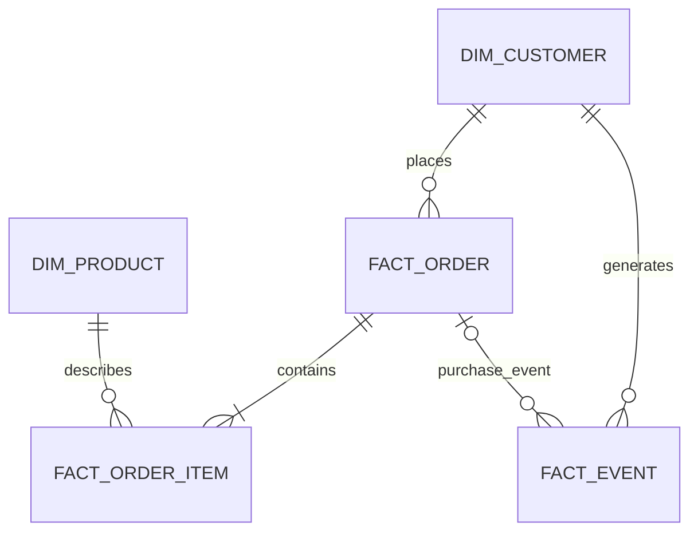

# Spark 测试数据集

`sparkmind_retail` 是一套可确定性重复生成的零售数据。它同时提供分区 CSV、嵌套 JSON Lines，以及装载后的 Hive 管理表，适合真实运行 Spark 读写、Join、Shuffle、窗口、数据质量和性能分析。

## 数据分层

| 层 | 格式 | 数据 | 用途 |
|---|---|---|---|
| Raw | CSV | 客户、商品、订单、订单项 | Schema、分区发现、宽窄表 Join、金额聚合 |
| Raw | JSON Lines | 用户行为事件，包含 device/page/attributes 嵌套对象 | 半结构化解析、坏记录、事件时间分析 |
| Hive | Parquet 管理表 | 五张清洗后表，事实表按 `dt` 分区 | Spark SQL、分区裁剪、窗口和性能调优 |

业务关系：



## 表设计

| Hive 表 | 主键或粒度 | 关键字段 | 分区 |
|---|---|---|---|
| `dim_customer` | 一行一个客户 | 城市、等级、年龄、活跃状态、邮箱 | 无 |
| `dim_product` | 一行一个商品 | 类目、品牌、售价、成本、下架状态 | 无 |
| `fact_order` | 一行一个订单版本 | 客户、状态、渠道、金额、时间 | `dt` |
| `fact_order_item` | 一行一个订单商品项 | 商品、数量、单价、折扣、金额 | `dt` |
| `fact_event` | 一行一个行为事件 | 会话、事件类型、嵌套设备和页面、采集时间 | `dt` |

生成器有意植入以下现象，便于验证 Agent 是否真正发现问题：

- 热门客户和热门商品造成 Join/聚合倾斜。
- 重复订单号，适合窗口去重和数据质量检查。
- 负订单金额、空邮箱和空年龄。
- JSON 坏行，通过 `_corrupt_record` 保留。
- 超过 24 小时才到达的迟到事件。
- 订单状态包含取消、退款，统计 GMV 时必须明确口径。

## 规模档位

| 档位 | 客户 | 商品 | 订单 | 订单项约数 | 事件 | 适用场景 |
|---|---:|---:|---:|---:|---:|---|
| `tiny` | 100 | 30 | 1,000 | 2,500 | 5,000 | 快速正确性检查 |
| `small` | 10,000 | 1,000 | 100,000 | 250,000 | 500,000 | 默认本地双核集群 |
| `medium` | 100,000 | 20,000 | 5,000,000 | 12,500,000 | 20,000,000 | Shuffle、倾斜、调优实验 |
| `large` | 1,000,000 | 100,000 | 50,000,000 | 125,000,000 | 200,000,000 | 多 Worker 压测 |

磁盘占用受文本内容和文件系统影响，建议预留约 `small` 0.5 GB、`medium` 15 GB、`large` 150 GB。生成过程逐行写文件，不随数据量线性占用内存。可用 `--orders`、`--events` 等参数覆盖任意档位。

## 生成和装载

在仓库根目录执行：

```bash
.venv/bin/python scripts/generate_spark_test_data.py --preset small
docker compose up -d spark-master spark-worker spark-history
docker compose --profile jobs run --rm -T spark-client \
  /opt/spark/bin/spark-submit \
  --master spark://spark-master:7077 \
  --conf spark.sql.catalogImplementation=hive \
  --conf spark.sql.warehouse.dir=file:/opt/sparkos/data/hive/warehouse \
  --conf 'spark.hadoop.javax.jdo.option.ConnectionURL=jdbc:derby:;databaseName=/opt/sparkos/data/hive/metastore_db;create=true' \
  /opt/sparkos/scripts/load_spark_test_data.py
```

装载脚本完成五张表后会自动刷新 `artifacts/catalog/catalog.json`。因此后续问数无需先提供表结构：先查 Catalog，再按需读取目标表字段。外部新增或修改 Hive 表后，可使用 `get_data_catalog(refresh=true)` 强制刷新。

对于额外文件，流程是：`inspect_data_source` 检查格式和样例 → `register_dataset` 注册为 Hive-managed Parquet → 再通过 Catalog 查询并问数。默认不覆盖已有表。

数据生成在 `data/sparkmind_retail/`，Hive warehouse 和 Derby metastore 在 `data/hive/`。这两个目录已由 `.gitignore` 排除。相同参数与 seed 会得到相同内容；重新生成会先替换整个输出目录。

验证表和分区：

```sql
SHOW TABLES IN sparkmind_demo;
SHOW PARTITIONS sparkmind_demo.fact_order;

SELECT 'customers' AS name, COUNT(*) AS rows FROM sparkmind_demo.dim_customer
UNION ALL SELECT 'products', COUNT(*) FROM sparkmind_demo.dim_product
UNION ALL SELECT 'orders', COUNT(*) FROM sparkmind_demo.fact_order
UNION ALL SELECT 'order_items', COUNT(*) FROM sparkmind_demo.fact_order_item
UNION ALL SELECT 'events', COUNT(*) FROM sparkmind_demo.fact_event;
```

## 建议的真实任务

1. **基础统计**：按天和渠道计算有效订单量、GMV、客单价，验证分区裁剪。
2. **漏斗分析**：以 session 为粒度计算浏览、加购、结算、购买转化率。
3. **RFM 用户分层**：使用窗口函数生成客户分数和分群。
4. **商品排行**：订单项 Join 商品维表，计算每类 Top 5。
5. **数据质量**：检查重复订单、负金额、空字段、JSON 坏行和迟到事件。
6. **倾斜诊断**：寻找事件量最高的客户，观察聚合 Stage 长尾，再尝试加盐。
7. **小表广播**：对比商品维表普通 Join 与 `BROADCAST` hint 的执行计划。
8. **小文件实验**：把 `--max-rows-per-file` 调低，观察文件数和扫描开销。

对应 SQL 位于 `examples/spark/queries/`。在 SparkMind 中可直接要求 Agent 读取某个 SQL 文件并执行；Hive 元仓库已配置为跨作业持久化。

## 重置

删除 `data/sparkmind_retail/` 可重建 Raw 数据。删除 `data/hive/` 会同时清空本地 Hive 表和元数据；操作前应停止正在运行的 Spark 作业。
