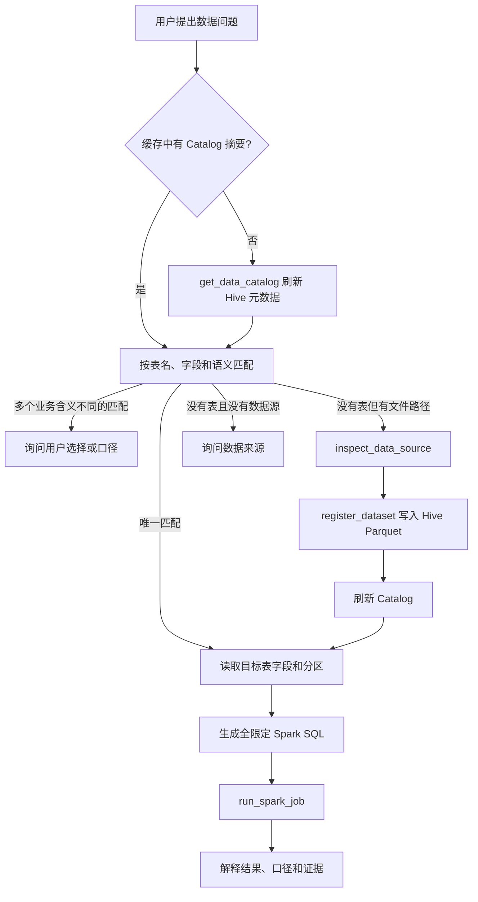

# Dynamic Data Catalog And Ingestion Implementation Plan

> **For agentic workers:** REQUIRED SUB-SKILL: Use superpowers:subagent-driven-development (recommended) or superpowers:executing-plans to implement this plan task-by-task. Steps use checkbox (`- [ ]`) syntax for tracking.

**Goal:** 让 SparkMind 自动发现 Hive 中的真实表结构，并能将新的 CSV、JSON/JSONL、Parquet 数据注册为可查询的 Hive 表，使用户直接问数时优先自行选表，仅在确实缺少数据源或业务口径时追问。

**Architecture:** Hive Metastore 是技术元数据的唯一事实来源；Spark Catalog Backend 通过一次性 Spark 作业生成结构化快照，Catalog Store 在宿主机原子缓存。Agent 通过只读 `get_data_catalog` 和 `inspect_data_source` 工具发现数据，通过显式 `register_dataset` 将新数据规范化为 Hive Parquet 表；Planner 只接收紧凑的 Catalog 摘要，完整字段按需查询，避免把整个 Catalog 塞进提示词。

**Tech Stack:** Python 3.14、PySpark/Spark SQL 3.5.3、Hive Catalog 2.3.9、Docker Compose、YAML、JSON、pytest/unittest。

## Global Constraints

- 保持现有 `SparkJobRunner` 作为唯一 Spark 作业提交入口，不复制 Docker Compose 子进程管理逻辑。
- 第一版支持 `csv`、`json`/`jsonl`、`parquet`；JDBC、Iceberg、Delta 不进入本计划。
- Catalog 刷新只读取元数据，不执行 `COUNT(*)`、全表采样或 `ANALYZE TABLE`。
- 新数据注册默认 `error_if_exists`，禁止静默覆盖现有 Hive 表。
- 路径必须位于仓库根目录内；database、table 和 partition column 必须通过标识符校验。
- Hive Metastore 的表结构是技术事实来源；YAML 只覆盖业务描述、关联关系和指标口径。
- Catalog 工具结果必须是结构化 JSON，并限制返回表数、字段数和样例行数，避免突破模型上下文。
- 用户问数且默认 Catalog 存在匹配表时，不以“请提供表结构”作为第一响应。
- 所有生产代码遵循 TDD：先写失败测试、确认失败原因、实现、再运行回归。

---

## Scope And Delivery Order

本项目分成三个可独立验收的里程碑：

1. **Catalog Discovery**：发现现有 Hive 表并让 Agent 自动选表，优先解决当前问题。
2. **Generic Ingestion**：检查并注册新的 CSV、JSON/JSONL、Parquet 数据。
3. **Semantic Querying**：合并业务口径，完成不同数据集上的端到端问数。

第一里程碑完成后即可上线使用，不需要等待通用数据注册全部完成。

## File Structure

### Create

- `sparkos/infrastructure/catalog/models.py`：Catalog、数据源检查和注册请求的不可变领域模型。
- `sparkos/infrastructure/catalog/store.py`：Catalog JSON 快照的原子读写和 TTL 判断。
- `sparkos/infrastructure/catalog/spark_backend.py`：通过 `SparkJobRunner` 发现 Hive 元数据、检查数据源、注册数据集。
- `sparkos/infrastructure/catalog/service.py`：缓存、过滤、语义覆盖、刷新和注册后的失效管理。
- `sparkos/infrastructure/catalog/__init__.py`：稳定导出接口。
- `sparkos/agent/skills/data-catalog/SKILL.md`：Agent 的发现、选表、注册和追问规则。
- `config/semantic_catalog.yaml`：默认数据库、表说明、关联关系和指标定义。
- `tests/test_catalog_models.py`：输入校验和序列化测试。
- `tests/test_catalog_store.py`：原子缓存与 TTL 测试。
- `tests/test_catalog_backend.py`：Spark 作业代码、快照解析、数据源注册测试。
- `tests/test_catalog_service.py`：缓存命中、刷新、过滤和语义合并测试。
- `tests/test_catalog_tools.py`：三个 Agent 工具的契约与分发测试。
- `tests/test_catalog_planning.py`：Catalog 摘要进入 Planner、问数不先索要表结构的测试。
- `tests/test_catalog_integration.py`：真实 Docker Spark/Hive 的端到端测试，默认标记为 integration。

### Modify

- `config/config.py`：增加 `CatalogConfig` 和 `get_catalog_config()`。
- `config/config.yaml`：增加 Catalog 缓存和默认数据库配置。
- `sparkos/agent/planner.py`：`PlanningContext` 增加紧凑 Catalog 摘要。
- `sparkos/agent/llm_planner.py`：Planner 请求携带摘要，并规定先发现再追问。
- `sparkos/agent/runtime.py`：构造规划上下文时读取缓存摘要。
- `sparkos/agent/context.py`：执行模型上下文中加入默认 Catalog 摘要。
- `sparkos/agent/system_prompt.md`：增加数据问题的确定性决策顺序。
- `sparkos/agent/tools/registry.py`：注册和分发三个 Catalog 工具。
- `sparkos/agent/skills/spark-sql/SKILL.md`：已有 Catalog 时先查 Catalog，不直接要求用户给表。
- `scripts/load_spark_test_data.py`：装载完成后刷新 Catalog 快照。
- `README.md`：补充自动发现和新数据注册示例。
- `docs/spark-test-data.md`：补充 Catalog 更新和问数流程。

---

### Task 1: Catalog Domain Models And Configuration

**Files:**
- Create: `sparkos/infrastructure/catalog/models.py`
- Create: `sparkos/infrastructure/catalog/__init__.py`
- Modify: `config/config.py`
- Modify: `config/config.yaml`
- Test: `tests/test_catalog_models.py`
- Test: `tests/test_config.py`

**Interfaces:**
- Produces: `ColumnMetadata`, `TableMetadata`, `DatabaseMetadata`, `CatalogSnapshot`, `CatalogQuery`, `DataSourceInspectRequest`, `DatasetRegistrationRequest`, `CatalogConfig`。
- Consumes: `Path`, `Literal`, repository root from `SPARKOS_REPO_ROOT`。

- [ ] **Step 1: Write failing model validation tests**

```python
def test_registration_rejects_path_outside_repo(tmp_path: Path) -> None:
    with pytest.raises(ValueError, match="工作目录"):
        DatasetRegistrationRequest(
            repo_root=tmp_path / "repo",
            path=tmp_path / "outside.csv",
            data_format="csv",
            database="analytics",
            table="sales",
        )


def test_registration_rejects_invalid_identifier(tmp_path: Path) -> None:
    source = tmp_path / "repo/data/sales.csv"
    source.parent.mkdir(parents=True)
    source.touch()
    with pytest.raises(ValueError, match="table"):
        DatasetRegistrationRequest(
            repo_root=tmp_path / "repo",
            path=source,
            data_format="csv",
            database="analytics",
            table="sales; drop table x",
        )


def test_catalog_snapshot_round_trips_json() -> None:
    snapshot = CatalogSnapshot(
        generated_at="2026-08-18T10:00:00+08:00",
        databases=(DatabaseMetadata(name="sparkmind_demo", tables=()),),
    )
    assert CatalogSnapshot.from_json(snapshot.to_json()) == snapshot
```

- [ ] **Step 2: Run tests and confirm missing imports fail**

Run: `.venv/bin/python -m pytest tests/test_catalog_models.py -q`

Expected: collection fails because `sparkos.infrastructure.catalog.models` does not exist.

- [ ] **Step 3: Implement immutable models and validation**

Use these exact public signatures:

```python
DataFormat = Literal["auto", "csv", "json", "jsonl", "parquet"]

@dataclass(frozen=True)
class ColumnMetadata:
    name: str
    data_type: str
    nullable: bool
    is_partition: bool = False
    description: str = ""

@dataclass(frozen=True)
class TableMetadata:
    database: str
    name: str
    table_type: str
    provider: str
    location: str
    columns: tuple[ColumnMetadata, ...]
    description: str = ""

    @property
    def qualified_name(self) -> str:
        return f"{self.database}.{self.name}"

@dataclass(frozen=True)
class DatabaseMetadata:
    name: str
    tables: tuple[TableMetadata, ...]

@dataclass(frozen=True)
class CatalogSnapshot:
    generated_at: str
    databases: tuple[DatabaseMetadata, ...]
    warnings: tuple[str, ...] = ()

    def to_json(self) -> str: ...
    @classmethod
    def from_json(cls, value: str) -> "CatalogSnapshot": ...

@dataclass(frozen=True)
class CatalogQuery:
    database: str | None = None
    table: str | None = None
    search: str | None = None
    refresh: bool = False

@dataclass(frozen=True)
class DataSourceInspectRequest:
    repo_root: Path
    path: Path
    data_format: DataFormat = "auto"
    options: Mapping[str, str] = field(default_factory=dict)
    sample_rows: int = 5

@dataclass(frozen=True)
class DatasetRegistrationRequest:
    repo_root: Path
    path: Path
    data_format: DataFormat
    database: str
    table: str
    options: Mapping[str, str] = field(default_factory=dict)
    partition_columns: tuple[str, ...] = ()
    schema_ddl: str | None = None
    if_exists: Literal["error", "overwrite"] = "error"
```

Identifiers use `^[A-Za-z_][A-Za-z0-9_]*$`. Resolve source paths before checking `is_relative_to(repo_root.resolve())`. `sample_rows` range is 1 to 20. Freeze copied mappings with `MappingProxyType(dict(options))`.

- [ ] **Step 4: Add Catalog configuration**

```python
@dataclass(frozen=True)
class CatalogConfig:
    enabled: bool
    default_database: str
    cache_path: str
    cache_ttl_seconds: int
    semantic_path: str
    max_tables_per_response: int
    max_columns_per_response: int


def get_catalog_config(path: str | None = None) -> CatalogConfig:
    cfg = load(path).get("catalog", {})
    return CatalogConfig(
        enabled=bool(cfg.get("enabled", True)),
        default_database=str(cfg.get("default_database", "default")),
        cache_path=str(cfg.get("cache_path", "artifacts/catalog/catalog.json")),
        cache_ttl_seconds=int(cfg.get("cache_ttl_seconds", 300)),
        semantic_path=str(cfg.get("semantic_path", "config/semantic_catalog.yaml")),
        max_tables_per_response=int(cfg.get("max_tables_per_response", 50)),
        max_columns_per_response=int(cfg.get("max_columns_per_response", 200)),
    )
```

Add to `config/config.yaml`:

```yaml
catalog:
  enabled: true
  default_database: sparkmind_demo
  cache_path: artifacts/catalog/catalog.json
  cache_ttl_seconds: 300
  semantic_path: config/semantic_catalog.yaml
  max_tables_per_response: 50
  max_columns_per_response: 200
```

Reject blank database names, TTL below 0, and limits below 1 in `get_catalog_config()`.

- [ ] **Step 5: Run focused and existing configuration tests**

Run: `.venv/bin/python -m pytest tests/test_catalog_models.py tests/test_config.py -q`

Expected: all pass.

- [ ] **Step 6: Commit the domain contract**

```bash
git add config/config.py config/config.yaml sparkos/infrastructure/catalog tests/test_catalog_models.py tests/test_config.py
git commit -m "feat: define dynamic catalog contracts"
```

---

### Task 2: Atomic Catalog Store And Spark Metadata Backend

**Files:**
- Create: `sparkos/infrastructure/catalog/store.py`
- Create: `sparkos/infrastructure/catalog/spark_backend.py`
- Test: `tests/test_catalog_store.py`
- Test: `tests/test_catalog_backend.py`

**Interfaces:**
- Consumes: `CatalogSnapshot`, `SparkJobRunner`, `SparkJobRequest` from Task 1 and existing Spark infrastructure.
- Produces: `CatalogStore.load()`, `CatalogStore.save()`, `CatalogStore.is_fresh()`, `SparkCatalogBackend.discover()`.

- [ ] **Step 1: Write failing store tests**

```python
def test_store_saves_snapshot_atomically(tmp_path: Path) -> None:
    store = CatalogStore(tmp_path / "catalog.json", ttl_seconds=300)
    snapshot = CatalogSnapshot(generated_at="2026-08-18T10:00:00+08:00", databases=())
    store.save(snapshot)
    assert store.load() == snapshot
    assert not list(tmp_path.glob("*.tmp"))


def test_corrupt_cache_is_treated_as_miss(tmp_path: Path) -> None:
    path = tmp_path / "catalog.json"
    path.write_text("{bad", encoding="utf-8")
    assert CatalogStore(path, ttl_seconds=300).load() is None
```

- [ ] **Step 2: Verify the store tests fail**

Run: `.venv/bin/python -m pytest tests/test_catalog_store.py -q`

Expected: import failure for `CatalogStore`.

- [ ] **Step 3: Implement `CatalogStore`**

```python
class CatalogStore:
    def __init__(self, path: Path, ttl_seconds: int) -> None: ...
    def load(self) -> CatalogSnapshot | None: ...
    def save(self, snapshot: CatalogSnapshot) -> None: ...
    def is_fresh(self, now: datetime | None = None) -> bool: ...
```

Write UTF-8 JSON to a sibling temporary file, flush, `os.fsync()`, then `os.replace()`. Freshness uses cache file `mtime`; `ttl_seconds == 0` means every explicit lookup refreshes.

- [ ] **Step 4: Write failing backend tests with a fake Spark runner**

```python
class FakeRunner:
    async def run(self, request: SparkJobRequest) -> SparkJobResult:
        self.request = request
        output_path = extract_snapshot_path(request.code)
        output_path.parent.mkdir(parents=True, exist_ok=True)
        output_path.write_text(valid_snapshot_json(), encoding="utf-8")
        return succeeded_result()


async def test_discover_runs_hive_enabled_metadata_job(tmp_path: Path) -> None:
    backend = SparkCatalogBackend(repo_root=tmp_path, runner=FakeRunner())
    snapshot = await backend.discover()
    assert snapshot.databases[0].tables[0].qualified_name == "sparkmind_demo.fact_order"
    assert "spark.catalog.listDatabases()" in backend.runner.request.code
    assert "count(" not in backend.runner.request.code.lower()
```

- [ ] **Step 5: Implement metadata discovery through an artifact**

```python
class CatalogBackend(Protocol):
    async def discover(self) -> CatalogSnapshot: ...


class SparkCatalogBackend:
    def __init__(self, repo_root: Path, runner: SparkJobRunner) -> None: ...
    async def discover(self) -> CatalogSnapshot: ...
```

`discover()` generates a unique host path under `artifacts/catalog/jobs/<uuid>/snapshot.json` and submits a PySpark request. The generated job must:

1. Create `SparkSession.builder.enableHiveSupport().getOrCreate()`.
2. Iterate `spark.catalog.listDatabases()`.
3. Iterate `spark.catalog.listTables(database)` and skip temporary tables.
4. Read columns through `spark.catalog.listColumns(table, database)`.
5. Parse provider/location from `DESCRIBE TABLE EXTENDED` without scanning table data.
6. Write one JSON artifact under `/opt/sparkos/artifacts/catalog/jobs/...`.
7. Stop Spark in `finally`.

After `runner.run()`, require `status == "succeeded"`, require the artifact to exist, parse it with `CatalogSnapshot.from_json()`, then remove only the unique job directory.

- [ ] **Step 6: Verify backend errors remain explicit**

Add tests for failed Spark status, missing artifact and invalid JSON. Each must raise `CatalogDiscoveryError` containing the job status or artifact path; no stale snapshot is written on failure.

- [ ] **Step 7: Run focused tests**

Run: `.venv/bin/python -m pytest tests/test_catalog_store.py tests/test_catalog_backend.py -q`

Expected: all pass.

- [ ] **Step 8: Commit Catalog persistence and discovery**

```bash
git add sparkos/infrastructure/catalog tests/test_catalog_store.py tests/test_catalog_backend.py
git commit -m "feat: discover and cache Hive catalog"
```

---

### Task 3: Catalog Service And Read-Only Agent Tool

**Files:**
- Create: `sparkos/infrastructure/catalog/service.py`
- Modify: `sparkos/infrastructure/catalog/__init__.py`
- Modify: `sparkos/agent/tools/registry.py`
- Test: `tests/test_catalog_service.py`
- Test: `tests/test_catalog_tools.py`

**Interfaces:**
- Consumes: store/backend from Task 2 and `CatalogQuery` from Task 1.
- Produces: `CatalogService.get_catalog(query) -> dict[str, Any]`, Agent tool `get_data_catalog`.

- [ ] **Step 1: Write service cache and filtering tests**

```python
async def test_get_catalog_uses_fresh_cache_without_spark() -> None:
    service = CatalogService(config=config(), store=fresh_store(), backend=AsyncMock())
    result = await service.get_catalog(CatalogQuery(database="sparkmind_demo"))
    assert result["default_database"] == "sparkmind_demo"
    assert result["tables"][0]["name"] == "fact_order"
    service.backend.discover.assert_not_awaited()


async def test_specific_table_returns_columns() -> None:
    result = await service.get_catalog(CatalogQuery(database="sparkmind_demo", table="fact_order"))
    assert result["table"]["qualified_name"] == "sparkmind_demo.fact_order"
    assert "order_id" in [column["name"] for column in result["table"]["columns"]]
```

- [ ] **Step 2: Implement service refresh and bounded response rules**

```python
class CatalogService:
    def __init__(
        self,
        config: CatalogConfig,
        store: CatalogStore,
        backend: CatalogBackend,
    ) -> None: ...

    async def get_catalog(self, query: CatalogQuery) -> dict[str, Any]: ...
    def cached_summary(self) -> dict[str, Any]: ...
    def invalidate(self) -> None: ...
```

Response rules:

- No database/table: return databases and table counts only.
- Database only: return table names, descriptions, types, providers and partition columns.
- Database plus table: return full bounded column details.
- `search`: case-insensitive match against qualified table name, description, column name and column description.
- `refresh=true` bypasses TTL.
- Missing table returns `{"status": "not_found", "available_tables": [...]}` rather than an exception.

- [ ] **Step 3: Add failing registry contract test**

```python
def test_registry_exposes_catalog_lookup() -> None:
    functions = {item["function"]["name"]: item["function"] for item in TOOL_DEFINITIONS}
    tool = functions["get_data_catalog"]
    assert tool["parameters"]["additionalProperties"] is False
    assert set(tool["parameters"]["properties"]) == {"database", "table", "search", "refresh"}
```

- [ ] **Step 4: Register and dispatch `get_data_catalog`**

Tool schema:

```json
{
  "name": "get_data_catalog",
  "description": "查询当前 Spark Hive Catalog。问数前用它发现数据库、表、字段和分区；已有 Catalog 时不要先要求用户提供表结构。",
  "parameters": {
    "type": "object",
    "additionalProperties": false,
    "properties": {
      "database": {"type": "string"},
      "table": {"type": "string"},
      "search": {"type": "string"},
      "refresh": {"type": "boolean", "default": false}
    }
  }
}
```

Create `_CATALOG_SERVICE` lazily, following `_get_advisor()` rather than constructing it at import time. `_get_data_catalog(arguments)` must return `json.dumps(result, ensure_ascii=False)`.

- [ ] **Step 5: Run service and registry tests**

Run: `.venv/bin/python -m pytest tests/test_catalog_service.py tests/test_catalog_tools.py tests/test_agent_tools.py -q`

Expected: all pass.

- [ ] **Step 6: Commit the first usable milestone**

```bash
git add sparkos/infrastructure/catalog sparkos/agent/tools/registry.py tests/test_catalog_service.py tests/test_catalog_tools.py
git commit -m "feat: expose Hive catalog discovery tool"
```

**Milestone 1 acceptance:** A tool call with `{"database":"sparkmind_demo"}` returns the five loaded tables; a second call within TTL performs no Spark job.

---

### Task 4: Make Planning And Execution Catalog-Aware

**Files:**
- Create: `sparkos/agent/skills/data-catalog/SKILL.md`
- Modify: `sparkos/agent/planner.py`
- Modify: `sparkos/agent/llm_planner.py`
- Modify: `sparkos/agent/runtime.py`
- Modify: `sparkos/agent/context.py`
- Modify: `sparkos/agent/system_prompt.md`
- Modify: `sparkos/agent/skills/spark-sql/SKILL.md`
- Test: `tests/test_catalog_planning.py`
- Test: `tests/test_llm_planner.py`
- Test: `tests/test_agent_context.py`

**Interfaces:**
- Consumes: `CatalogService.cached_summary()` and `get_data_catalog` from Task 3.
- Produces: `PlanningContext.catalog_summary`, deterministic discovery-first prompt rules.

- [ ] **Step 1: Add a failing PlanningContext payload test**

```python
async def test_planner_receives_cached_catalog_summary() -> None:
    context = planning_context(catalog_summary={
        "default_database": "sparkmind_demo",
        "tables": ["fact_order", "fact_event"],
    })
    await LLMPlanner(model).create_plan(AgentTask(goal="统计每天 GMV"), context)
    payload = json.loads(model.requests[0][1]["content"])
    assert payload["catalog_summary"]["default_database"] == "sparkmind_demo"
    assert "fact_order" in payload["catalog_summary"]["tables"]
```

- [ ] **Step 2: Extend PlanningContext and Runtime wiring**

```python
@dataclass(frozen=True)
class PlanningContext:
    session_id: str | None
    summary: str
    recent_messages: tuple[ChatMessage, ...]
    skills: tuple[SkillCapability, ...]
    tool_names: tuple[str, ...]
    catalog_summary: Mapping[str, Any] = field(default_factory=dict)
```

`AgentRuntime` receives a `CatalogService | None` dependency. Its planning context uses `catalog_service.cached_summary()` only; planning never blocks on a fresh Spark job. Add `catalog_summary` to both initial and replan JSON payloads.

- [ ] **Step 3: Add discovery-first rules to both model prompts**

Add these exact decisions to `_PLANNER_PROMPT_TEMPLATE` and `system_prompt.md`:

```text
- 数据问答缺少表名时，先检查 catalog_summary；摘要为空或字段不足且 get_data_catalog 可用时，规划 Catalog 发现步骤，不要先要求用户提供表结构。
- Catalog 存在唯一合理匹配时使用该表；存在多个业务含义不同的匹配时才询问用户选择。
- Catalog 中没有表，且用户也没有给文件路径或数据源时，才询问数据来源。
- 指标名称存在歧义且 Catalog 语义层没有定义时，询问指标口径，不猜测业务定义。
```

- [ ] **Step 4: Build the data-catalog skill**

The skill workflow must be:

1. Call `get_data_catalog` with default database or business search term.
2. Request one selected table to get columns and partitions.
3. Generate SQL with fully qualified table names and partition filters.
4. Call `run_spark_job` once.
5. Explain result and metric assumptions.
6. If no tables exist, call `inspect_data_source` only when a path exists; otherwise ask for the data source.

Update `spark-sql/SKILL.md` step 2 from “缺少关键字段，向 Runtime 返回缺失信息” to “先使用 Catalog 发现；Catalog 仍不包含所需字段时再返回缺失信息”。

- [ ] **Step 5: Inject the compact summary into execution context**

Add an optional `catalog_summary` argument to `AgentContext.build_messages()`. Render at most database names and table names in a system message:

```text
当前数据目录摘要：默认数据库 sparkmind_demo；可用表 dim_customer, dim_product, fact_order, fact_order_item, fact_event。字段和分区必须通过 get_data_catalog 按需获取。
```

Do not inject columns for every table.

- [ ] **Step 6: Test the exact regression scenario**

Use a fake planning model response that creates a first step “调用 get_data_catalog 查找订单表” and assert the Runtime emits `PlanCreated`, not `ClarificationRequested`. Also assert the prompt contains the discovery-first rule when `catalog_summary` is empty.

- [ ] **Step 7: Run planning and context regression tests**

Run: `.venv/bin/python -m pytest tests/test_catalog_planning.py tests/test_llm_planner.py tests/test_agent_context.py tests/test_agent_runtime.py -q`

Expected: all pass.

- [ ] **Step 8: Commit catalog-aware planning**

```bash
git add sparkos/agent tests/test_catalog_planning.py tests/test_llm_planner.py tests/test_agent_context.py tests/test_agent_runtime.py
git commit -m "feat: make data questions catalog aware"
```

**Milestone 1 final acceptance:** With `sparkmind_demo` cached, “统计每天 GMV” proceeds to Catalog lookup/SQL execution and never asks for a table name.

---

### Task 5: Generic Source Inspection

**Files:**
- Modify: `sparkos/infrastructure/catalog/spark_backend.py`
- Modify: `sparkos/infrastructure/catalog/service.py`
- Modify: `sparkos/agent/tools/registry.py`
- Test: `tests/test_catalog_backend.py`
- Test: `tests/test_catalog_tools.py`

**Interfaces:**
- Consumes: `DataSourceInspectRequest`.
- Produces: `SparkCatalogBackend.inspect_source()`, `CatalogService.inspect_source()`, Agent tool `inspect_data_source`.

- [ ] **Step 1: Write failing source inspection tests**

```python
async def test_inspect_csv_returns_schema_samples_and_file_summary(tmp_path: Path) -> None:
    request = DataSourceInspectRequest(
        repo_root=tmp_path,
        path=tmp_path / "data/sales.csv",
        data_format="csv",
        options={"header": "true", "inferSchema": "true"},
        sample_rows=3,
    )
    result = await backend.inspect_source(request)
    assert result["format"] == "csv"
    assert result["columns"][0] == {"name": "order_id", "data_type": "string", "nullable": True}
    assert len(result["sample_rows"]) == 3
```

- [ ] **Step 2: Implement format detection and bounded inspection**

```python
async def inspect_source(self, request: DataSourceInspectRequest) -> dict[str, Any]: ...
```

Detection rules:

- `.csv` -> `csv`
- `.json` or `.jsonl` -> `json`
- `.parquet` or directory containing Parquet part files -> `parquet`
- Mixed recognizable formats in one directory -> return `status=ambiguous` and detected formats.

The generated PySpark job reads the source, returns `df.schema.json()`, at most `sample_rows` via `limit().toJSON().collect()`, file count and total host-visible bytes. It must not call `df.count()`.

- [ ] **Step 3: Register `inspect_data_source`**

Tool properties: `path` required; `format`, `options`, `sample_rows` optional. The description must tell the Agent to use it before registration and not for already registered Hive tables.

- [ ] **Step 4: Verify path, size and output bounds**

Add tests for paths outside the repository, unknown extensions, sample rows above 20, nested JSON fields and a response larger than the configured output bound. Large samples must be truncated with `truncated=true`.

- [ ] **Step 5: Run focused tests and commit**

Run: `.venv/bin/python -m pytest tests/test_catalog_backend.py tests/test_catalog_tools.py -q`

```bash
git add sparkos/infrastructure/catalog sparkos/agent/tools/registry.py tests/test_catalog_backend.py tests/test_catalog_tools.py
git commit -m "feat: inspect Spark data sources"
```

---

### Task 6: Generic Dataset Registration

**Files:**
- Modify: `sparkos/infrastructure/catalog/spark_backend.py`
- Modify: `sparkos/infrastructure/catalog/service.py`
- Modify: `sparkos/agent/tools/registry.py`
- Test: `tests/test_catalog_backend.py`
- Test: `tests/test_catalog_service.py`
- Test: `tests/test_catalog_tools.py`

**Interfaces:**
- Consumes: `DatasetRegistrationRequest` and inspection result from Task 5.
- Produces: `register_dataset` tool and refreshed Hive Catalog snapshot.

- [ ] **Step 1: Write failing registration tests**

```python
async def test_register_csv_writes_managed_partitioned_parquet_table(tmp_path: Path) -> None:
    request = DatasetRegistrationRequest(
        repo_root=tmp_path,
        path=tmp_path / "data/sales",
        data_format="csv",
        database="analytics",
        table="sales",
        options={"header": "true", "inferSchema": "true"},
        partition_columns=("dt",),
    )
    result = await backend.register_dataset(request)
    assert result["qualified_name"] == "analytics.sales"
    assert result["storage_format"] == "parquet"
    assert result["partition_columns"] == ["dt"]
    assert ".saveAsTable(" in backend.runner.request.code
```

- [ ] **Step 2: Implement safe registration**

```python
async def register_dataset(self, request: DatasetRegistrationRequest) -> dict[str, Any]: ...
```

Generated job sequence:

1. Check whether the target table exists through `spark.catalog.tableExists()`.
2. If it exists and `if_exists == "error"`, write a structured `already_exists` result and stop before reading source data.
3. Read using explicit format/options and optional `schema_ddl`.
4. Validate every partition column exists in `df.columns`.
5. Create database if needed.
6. Write `mode("errorifexists")` or `mode("overwrite")`, `format("parquet")`, optional `partitionBy()`, then `saveAsTable()`.
7. Return qualified name, schema, partitions and storage location. Do not run a row count.

Wrap identifiers in backticks only after regex validation. Serialize all Python literals with `repr()`/JSON rather than string interpolation from raw user input.

- [ ] **Step 3: Invalidate and refresh Catalog after success**

`CatalogService.register_dataset()` calls backend registration, invalidates the store, then performs one metadata refresh. A failed registration preserves the previous valid snapshot.

- [ ] **Step 4: Register the mutating Agent tool**

Required fields: `path`, `format`, `database`, `table`. Optional fields: `options`, `partition_columns`, `schema_ddl`, `if_exists`.

Tool description must state:

- Call `inspect_data_source` first.
- Default `if_exists=error`.
- Use `overwrite` only when the user explicitly requested replacement.
- Registration copies/normalizes data into Hive-managed Parquet.

- [ ] **Step 5: Test failure and idempotency cases**

Cover missing source, invalid format, target exists, partition column missing, Spark failure, overwrite without explicit value, and successful refresh. Assert no tool path can register a location outside the repo.

- [ ] **Step 6: Run focused tests and commit**

Run: `.venv/bin/python -m pytest tests/test_catalog_backend.py tests/test_catalog_service.py tests/test_catalog_tools.py -q`

```bash
git add sparkos/infrastructure/catalog sparkos/agent/tools/registry.py tests/test_catalog_backend.py tests/test_catalog_service.py tests/test_catalog_tools.py
git commit -m "feat: register file datasets as Hive tables"
```

**Milestone 2 acceptance:** A previously unseen CSV or JSONL path can be inspected, registered as a Hive Parquet table and discovered by a subsequent `get_data_catalog` call without restarting SparkMind.

---

### Task 7: Semantic Catalog Overlay

**Files:**
- Create: `config/semantic_catalog.yaml`
- Modify: `sparkos/infrastructure/catalog/service.py`
- Modify: `sparkos/agent/skills/data-catalog/SKILL.md`
- Test: `tests/test_catalog_service.py`

**Interfaces:**
- Consumes: technical `CatalogSnapshot` and YAML semantic definitions.
- Produces: merged descriptions, joins, metrics and consistency warnings.

- [ ] **Step 1: Write failing semantic merge tests**

```python
def test_semantic_overlay_adds_metric_without_replacing_schema(tmp_path: Path) -> None:
    service = service_with_semantics(tmp_path, {
        "metrics": {
            "gmv": {
                "table": "sparkmind_demo.fact_order",
                "expression": "SUM(total_amount)",
                "filters": ["status IN ('paid', 'shipped', 'completed')", "total_amount >= 0"],
            }
        }
    })
    result = service.cached_summary()
    assert result["metrics"]["gmv"]["table"] == "sparkmind_demo.fact_order"
```

- [ ] **Step 2: Add the initial retail semantic definitions**

```yaml
version: 1
default_database: sparkmind_demo
tables:
  sparkmind_demo.fact_order:
    description: 订单事实表，一行一个订单版本
    time_column: order_ts
    partition_column: dt
  sparkmind_demo.fact_order_item:
    description: 订单商品项事实表
  sparkmind_demo.fact_event:
    description: 用户行为事件表，包含嵌套设备和页面字段
joins:
  - left: sparkmind_demo.fact_order.customer_id
    right: sparkmind_demo.dim_customer.customer_id
    relationship: many_to_one
  - left: sparkmind_demo.fact_order_item.product_id
    right: sparkmind_demo.dim_product.product_id
    relationship: many_to_one
metrics:
  gmv:
    description: 有效订单成交金额
    table: sparkmind_demo.fact_order
    expression: SUM(total_amount)
    filters:
      - status IN ('paid', 'shipped', 'completed')
      - total_amount >= 0
```

- [ ] **Step 3: Implement merge and drift warnings**

The service attaches semantic descriptions only to existing tables/columns. References to missing tables or columns become `warnings`; they never create fictional technical metadata. Metrics appear in the compact Planner summary by name, description and source table, but full expressions are returned only by a metric/table query.

- [ ] **Step 4: Run semantic service tests and commit**

Run: `.venv/bin/python -m pytest tests/test_catalog_service.py -q`

```bash
git add config/semantic_catalog.yaml sparkos/infrastructure/catalog/service.py sparkos/agent/skills/data-catalog/SKILL.md tests/test_catalog_service.py
git commit -m "feat: overlay business semantics on Hive catalog"
```

---

### Task 8: Loader Integration, Real Spark Verification And Documentation

**Files:**
- Modify: `scripts/load_spark_test_data.py`
- Create: `tests/test_catalog_integration.py`
- Modify: `README.md`
- Modify: `docs/spark-test-data.md`

**Interfaces:**
- Consumes: all previous tasks.
- Produces: refreshed snapshot after demo loading and documented operator workflow.

- [ ] **Step 1: Add an explicit catalog refresh mode to the demo loader**

After all five `saveAsTable()` calls succeed, invoke the same metadata extraction helper used by `SparkCatalogBackend` or run a documented host refresh command. Do not duplicate metadata schema. The loader output must include:

```text
catalog refreshed: artifacts/catalog/catalog.json
default database: sparkmind_demo
tables: 5
```

- [ ] **Step 2: Add opt-in Docker integration tests**

Mark with `@pytest.mark.integration` and skip unless `SPARKMIND_RUN_INTEGRATION=1`.

Test cases:

1. Refresh discovers the five existing `sparkmind_demo` tables.
2. `fact_order` reports `dt` as a partition column.
3. A temporary CSV fixture is inspected and registered under a unique table name.
4. A Spark SQL query against the new table returns the expected aggregate.
5. The temporary table and warehouse directory are dropped in `finally`.

- [ ] **Step 3: Run the complete unit suite**

Run: `.venv/bin/python -m pytest tests/ -q -m "not integration"`

Expected: all unit tests pass.

- [ ] **Step 4: Run the real Spark integration suite**

Run:

```bash
docker compose up -d spark-master spark-worker spark-history
SPARKMIND_RUN_INTEGRATION=1 .venv/bin/python -m pytest tests/test_catalog_integration.py -v
```

Expected: all integration cases pass and cleanup removes the temporary table.

- [ ] **Step 5: Verify the user regression through SparkMind**

Use these three prompts in a fresh session:

```text
统计每天的 GMV
按渠道看 2026-01-01 的订单量和收入
检查当前数据里有哪些质量问题
```

Acceptance evidence for each prompt:

- It calls `get_data_catalog` or uses a fresh cached summary.
- It selects a fully qualified `sparkmind_demo.*` table.
- It applies a date partition filter when a date is supplied.
- It executes `run_spark_job` and returns results.
- It does not ask the user to provide an existing table or schema.

- [ ] **Step 6: Document operator and user workflows**

README must contain:

```text
Existing Hive data: ask directly; SparkMind discovers the catalog.
New file data: inspect -> register -> query.
Schema changed externally: call get_data_catalog with refresh=true.
Business metric changed: edit config/semantic_catalog.yaml.
```

- [ ] **Step 7: Run final quality gates**

```bash
.venv/bin/ruff check sparkos tests scripts
.venv/bin/ruff format --check sparkos tests scripts
.venv/bin/python -m pytest tests/ -q -m "not integration"
git diff --check
```

Expected: zero lint errors, zero formatting changes, zero unit test failures and zero whitespace errors.

- [ ] **Step 8: Commit integration and docs**

```bash
git add scripts/load_spark_test_data.py tests/test_catalog_integration.py README.md docs/spark-test-data.md
git commit -m "test: verify dynamic catalog end to end"
```

**Milestone 3 acceptance:** Existing Hive tables work without table prompts, newly supplied CSV/JSON/Parquet files can be registered and queried, and business metrics are resolved from a versioned semantic layer.

---

## Runtime Decision Flow



## Operational Decisions

- **Cache policy:** 进程内存和 `artifacts/catalog/catalog.json` 双层缓存；默认 TTL 300 秒；注册成功强制失效并刷新。
- **Concurrency:** 同一进程内 Catalog 刷新使用 `asyncio.Lock` 合并并发请求，避免多个 Spark 元数据作业同时争用嵌入式 Derby Metastore。
- **Failure behavior:** 刷新失败时可返回仍存在的旧快照并标记 `stale=true` 和失败原因；没有旧快照时返回结构化 `unavailable`，不伪造表。
- **Data movement:** 注册把原始文件规范化为 Hive-managed Parquet；原始 CSV/JSON 保留，便于重放和审计。
- **Schema evolution:** 第一版重新注册时必须显式 `if_exists=overwrite`；不做隐式 merge schema。
- **Prompt size:** Planner 只拿数据库、表名、简短描述和指标名；完整列信息由工具按表获取。
- **Source of truth:** 表/字段/分区来自 Hive；描述/Join/指标来自 YAML；冲突时技术结构以 Hive 为准并输出 drift warning。

## Acceptance Matrix

| Scenario | Expected behavior |
|---|---|
| Hive 已有唯一订单表，用户问 GMV | 自动发现 `fact_order`，不索要表 |
| Hive 有多个相似订单表 | 返回差异并询问选择 |
| Hive 为空，用户给 CSV 路径 | 检查格式/Schema，注册后查询 |
| Hive 为空，用户只说“统计销售额” | 询问数据来源 |
| JSON 含嵌套对象 | 检查结果保留 struct，注册后可用点号查询 |
| CSV 大文件 | Catalog 不扫描；检查只取有限样例；注册由 Spark 分布式读取 |
| 目标表已存在 | 默认返回 `already_exists`，不覆盖 |
| 外部修改 Hive Schema | `refresh=true` 后快照更新并报告语义漂移 |
| Catalog Spark 刷新失败且有旧缓存 | 使用旧缓存并显示 `stale=true` |
| Catalog Spark 刷新失败且无缓存 | 返回 `unavailable` 并解释错误证据 |

## Deferred Scope

- JDBC 数据源及凭证管理。
- Iceberg、Delta Lake、Hudi catalog。
- 自动血缘、列级权限和多租户隔离。
- 基于 embedding 的大规模语义检索；第一版使用名称、描述和字段的确定性匹配。
- 自动覆盖或自动删除已有表。
- 自动推断复杂业务指标；指标必须来自语义 YAML 或用户确认。

## Self-Review

- Spec coverage: 包含现有 Hive 自动发现、不同文件格式接入、Agent 选表、业务口径、缓存、并发和真实 Spark 验证。
- Placeholder scan: 计划中的接口、参数、路径、命令和验收条件均已明确，没有未定实现项。
- Type consistency: `CatalogSnapshot` 贯穿 Backend、Store、Service；`CatalogQuery` 只用于读取；检查和注册分别使用独立请求类型。
- Scope discipline: 第一阶段即可修复当前体验；JDBC/Lakehouse/权限系统延后，避免阻塞核心问数链路。
